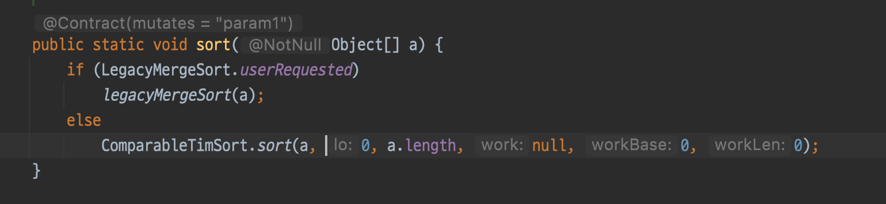

## 인터페이스의 default, static 메서드

### default 메서드
- 인터페이스 내에서 메서드를 구현한 것.
- 해당 인터페이스에 나중에 기능을 추가해야할 경우, 구현체들에서 따로 구현하지 않아도 문제가 발생하지 않도록 해준다.
  - 구현체의 값을 참조해서 사용할 경우 예상치 못한 에러가 발생할 수 있기 때문에 `@implSpec` 어노테이션으로 설명을 붙일것.
- equals, hashCode와 같이 Object 클래스에서 제공하는 메서드는 선언 불가.
- 인터페이스를 상속받은 인터페이스에서 해당 default 메서드를 다시 추상메서드로 변경이 가능하다.
- 동일한 default 메서드가 존재하는 인터페이스 여러개를 구현할 경우, 반드시 오버라이딩을 해줘야한다.

### static 메서드
- 해당 타입이 제공해야하는 유틸리티와 같은 경우 static으로 작성.


## 자바에서 제공하는 대표적인 default 메서드

### Iterable 클래스
1. `forEach()`
   - 매개값으로는 함수형 인터페이스인 Consumer를 받는다.
   - iterable을 구현한 객체의 값을 순회하는데 사용.

2. `spliterator()`
   - split 기능이 추가된 iterator라고 생각하면 된다.
     - stream은 내부에서 spliterator를 사용중이다.
   - tryAdvance 메서드 : 값이 존재하는 경우 매개값으로 함수를 실행하고 true를 반환한다.
   - trySplit : 해당 spliterator를 절반으로 나눈다.
   ```java
        Spliterator<String> spliterator = names.spliterator();
        Spliterator<String> spliterator2 = names.spliterator().trySplit();
        
        while(spliterator.tryAdvance(System.out::println));
        while(spliterator2.tryAdvance(System.out::println));
    ```
   

### Collection 클래스
1. stream() / parallelStream()
2. `removeIf(Predicate)`
   - predicate의 조건에 맞는 데이터를 제거하는 역할.


<br>

## Comparable, Comparator
- 해당 인터페이스를 구현한 클래스는 반드시 `compareTo()` or `compare()`메서드를 재정의 해줘야 한다.
- 해당 인터페이스를 구현한 객체를 담은 리스트들은 Collections.sort(), Arrays.sort() 메서드를 통해 정렬될 수 있다.

- 단순히 정렬을 위해서 사용해왔지만 사실은 **객체간의 비교를 가능**하게 해주는 역할이다.
- 비교한 결과값은 정수로 반환해야 하는데, 자기 자신이 더 크면 **양수**, 동등하면 **0**, 더 작으면 **음수** 을 반환해야한다. (보통은 1, 0, -1 을 사용한다.)
    - 자신의 값 - 비교 대상의 값 을 해도 되지만 각 값이 int의 범위를 넘어가게 되면 문제가 발생하기 때문에 직접 비교가 더 권장된다.

### Comparable
- 일반 인터페이스다.
- **자기 자신**과 **매개변수로 들어온 객체**를 비교한다.


### Compartator
- 함수형 인터페이스다.
- **매개변수로 들어온 2개의 객체를 비교**한다.

<br>

### 그럼 2개의 객체를 비교하기 위해서 굳이 Comparator 객체를 만들어야 하는걸까?
- 아니다. 익명 객체 혹은 람다를 이용해서 사용이 가능하다.
- 이 방식의 장점은, 필요한 상황에 맞게 다양한 조건으로 비교가 가능해진다.
```java
    Comparator<ComparatorMember> compareFunc = (m1, m2) -> {
            if(m1.customerGrade > m2.customerGrade) return 1;
            else if(m1.customerGrade == m2.customerGrade) return 0;
            else return -1;
    };
```

<br>

### 정렬하는데 사용하기 위해서는 어떤 조건을 가져야 하는가?

1. 배열의 내부에 저장되는 데이터가 Comparable 인터페이스를 구현했거나
2. sort 메서드의 2번째 매개변수로 Comparator 객체를 함께 넘겨주거나

<br>

#### 1. Arrays.sort()
- Arrays.sort() 내부에 들어가는 배열의 원소들은 반드시 Comparable 인터페이스를 구현해야하는데, 이건 내부에서 compareTo를 호출해서 비교하기 때문이다.
  - 내부에서 타고타고 들어가면 `mergeSort()` 라는 메서드가 있는데 내부에서 compartTo를 이용하고 있다.
  - 너무 다양한 정렬 알고리즘들이 구현되어 있어서 일부 메서드만 사진을 사용
- 만약 Comparable 인터페이스를 구현하지 않은 객체들이 담겨있는 경우, 2번째 인자로 Comparator를 구현한 객체를 함께 넣어주면 비교가 가능하다.

.png)

.png)

<br>

#### 2. Collections.sort()
- 내부에서 list.sort() 메서드를 사용하는데 해당 메서드 내부에서 Arrays.sort를 사용하고 있다. 결국 동일한 방식으로 동작한다.
- Arrays.sort()와 마찬가지로 Comparator를 두번째 매개변수로 넣을 수 있다.

<br>

.png)
.png)