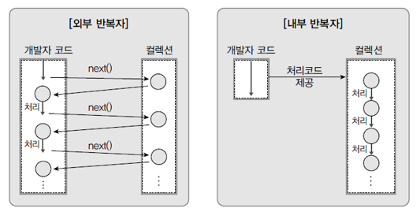
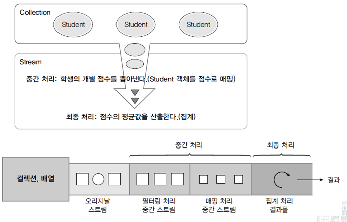
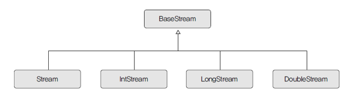
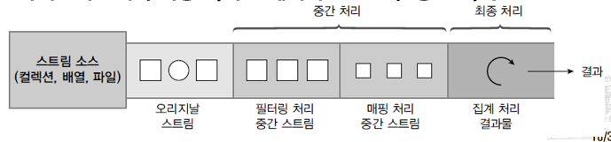
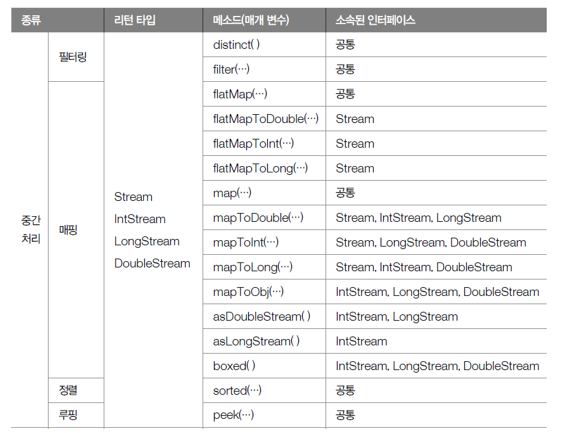
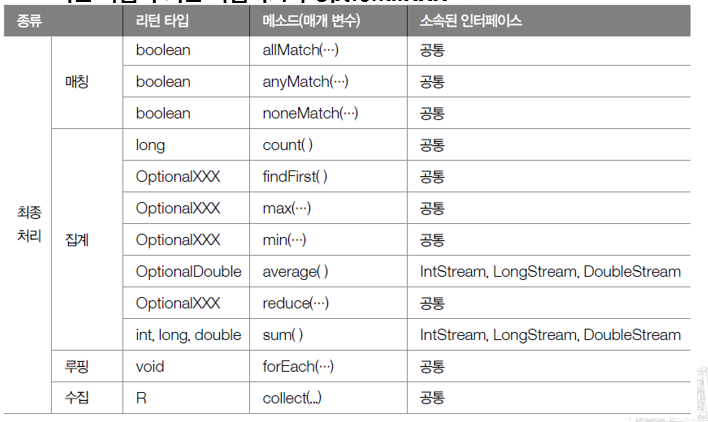

# 스트림

스트림은 자바8부터 추가된 컬렉션 및 배열의 저장 요소를 하나씩 참조해서 람다식으로 처리 할 수 있도록 해주는 반복자이다.

**자바 7 Iterator 방식**

```java
List<String> list = Arrays.asList("홍길동", "신용권", "김자바");
Iterator<String> iterator = list.iterator();
while(iterator.hasNext()) {
	String name = iterator.next();
	System.out.println(name);
}
```

**Stream 방식**

```java
List<String> list = Arrays.asList("홍길동", "신용권", "김자바");
Stream<String> stream = list.stream();
stream.forEach( name -> System.out.println(name) );
```

### 내부 반복자를 사용하므로 병렬 처리가 쉽다.

`외부 반복자`란 개발자가 코드로 직접 컬렉션의 요소를 반복해서 가져오는 코드 패턴을 말한다. (for문, while문)

`내부 반복자`는 컬렉션 내부에서 요소들을 반복시키고, 개발자는 요소당 처리해야 할 코드만 제공하는 코드 패턴을 말한다.



**내부 반복자를 사용해서 얻는 이점**

- 컬렉션 내부에서 어떻게 요소를 반복시킬 것인가는 컬렉션에 맡기고, 개발자는 요소 처리 코드에만 집중할 수 있음
- 요소들의 반복 순서를 변경하거나, 멀티 코어 CPU를 최대한 활용하기 위해 병렬 작업을 할 수 있게 도와 주기 때문에 순차적인 외부 반복자보다 효율적으로 요소를 반복시킬 수 있다.

**병렬 처리란 ?**

병렬 처리란 한 가지 작업을 서브 작업으로 나누고, 서브 작업들을 분리된 스레드에서 병렬적으로 처리하는 것을 말한다. 예를들면 컬렉션의 요소 총합을 구할 때 순차 처리 스트림은 하나의 스레드가 요소들을 순차적으로 읽어 합을 구하지만, 병렬 처리 스트림을 이용하면 여러 개의 스레드가 요소들을 부분적으로 합하고 이 부분을 최종 결합해서 전체 합을 생성한다.

**스트림은 중간 처리와 최종 처리를 할 수 있다.**



## 스트림의 종류

자바 8부터 새로 추가된 [java.uti.stream](http://java.uti.stream) 패키지에는 스트림 API들이 포진하고 있다.

BaseStream 인터페이스를 부모로 해서 자식 인터페이스들이 아래와 같이 상속 관계를 이루고 있다.



Stream은 객체 요소를 처리하는 스트림이고 나머지는 각각 기본타입 요소를 처리하는 스트림이다.

## 스트림 파이프라인



- 여러 개의 스트림이 연결되어 있는 구조
- 파이프라인에서 최종 처리를 제외하고는 모두 중간 처리 스트림

**중간처리 메서드**



**최종처리 메서드**



## 필터링

- 중간 처리 기능으로 요소 걸러내는 역할
- 필터링 메소드인 distinct()와 filter() 메소드
- 모든 스트림이 가지고 있는 공통 메소드
    
    
    

- distinct() 메소드 - 중복을 제거하는 기능
    - Stream의 경우 Object.equals(Object)가 true 동일한 객체로 판단해 중복 제거
    - IntStream, LongStream, DoubleStream은 동일값일 경우 중복 제거
        
        
        

- filter()메소드 - 매개값으로 주어진 Predicate가 true를 리턴하는 요소만 필터링
    
    
    
    

## 매핑

- 중간 처리 기능으로 스트림의 요소를 다른 요소로 대체하는 작업
- **flatMapXXX()메소드**
    - 요소를 대체하는 복수 개의 요소들로 구성된 새로운 스트림 리턴
        
        
        
    - flatMapXXX() 메소드의 종류
        
        
        
- **mapXXX() 메소드**
    - 요소를 대체하는 요소로 구성된 새로운 스트림 리턴
        
        
        

## asDoubleStream(), asLongStream, boxed()메소드


## 정렬

- 스트림은 요소가 최종 처리되기 전에 중간 단계에서 요소를 정렬
- 최종 처리 순서 변경 가능


## 루핑(looping)

- 요소 전체를 반복하는 것
- peek()
    - 중간 처리 메소드
    - 중간 처리 단계에서 전체 요소를 루핑하며 추가 작업하기 위해 사용
    - 최종처리 메소드가 실행되지 않으면 지연
        - 반드시 최종 처리 메소드가 호출되어야 동작
- forEach()
    - 최종 처리 메소드
    - 파이프라인 마지막에 루핑하여 요소를 하나씩 처리
    - 요소를 소비하는 최종 처리 메소드
        - sum()과 같은 다른 최종 메소드 호출 불가

## 매칭

- 최종 처리 단계에서 요소들이 특정 조건에 만족하는지 조사하는 것
- allMatch() 메소드
    - 모든 요소들이 매개값으로 주어진 Predicate의 조건을 만족하는지 조사
- anyMatch()메소드
    - 최소한 한 개의 요소가 매개값으로 주어진 Predicate조건을 만족하는지 조사
- noneMatch() 메소드
    - 모든 요소들이 매개값으로 주어진 Predicate의 조건을 만족하지 않는지 조사

## 집계

- 최종 처리 기능으로 요소들을 처리해 카운팅, 합계, 평균값, 최대값, 최소값 등과 같이 하나의 값으로 산출하는 것
- 집계는 대량의 데이터를 가공해서 축소하는 리덕션(Reduction)
- 스트림이 제공하는 기본 집계


## 커스텀 집계

- sum(), average(), count(), max(), min() 이용
    - 기본 집계 메소드 이용
- reduce() 메소드
    - 스트림의 요소를 줄여나가면서 수행하다 모든요소를 소모하면 결과반환
        
        
        

## 수집

- 요소들을 필터링 또는 매핑 한 후 요소들을 수집하는 최종 처리 메소드인 collect()
- 필요한 요소만 컬렉션으로 담을 수 있음
- 요소들을 그룹핑한 후 집계(리덕션)

## 필터링한 요소 수집

- Stream의 collect(Collector<T,A,R>collector)메소드
    - 필터링 또는 매핑된 요소들을 새로운 컬렉션에 수집하고, 이 컬렉션 리턴
        
        
        

## 매개값인 Collector

- 어떤 요소들 어떤 컬렉션에 수집할 것인지 결정
- Collector의 타입 파라미터 T는 요소
- A는 누적기(accumulator)
- R은 요소가 저장될 컬렉션
    - 해석하면 T요소를 A 누적기가 R에 저장한다는 의미
- Collectors 클래스의 정적 메소드
    
    
    

## 사용자 정의 컨테이너에 수집하기

- 스트림은 요소들을 필터링, 또는 매핑해 사용자 정의컨테이너 객체에 수집할 수 있도록
- 이를 위한 추가적인 collector() 메소드
    
    
    

## 요소를 그룹핑해서 수집

- collect()를 호출시 Collectors의 groupingBy() 또는 groupingByConcurrent()가 리턴하는 Collector를 매개값 대입
    - 컬렉션의 요소들을 그룹핑해서 Map 객체 생성
        
        
        

## 그룹핑 후 매핑 및 집계

- Collectors.groupingBy()메소드
    - 그룹핑 후, 매핑이나 집계(평균, 카운팅, 연결, 최대, 최소, 합계)를 할 수 있도록 두 번째 매개값으로 Collector를 가질 수 있는 특성
        
        
        

# 

[https://velog.io/@ansalstmd/이것은-자바다-16장스트림과-병렬처리](https://velog.io/@ansalstmd/%EC%9D%B4%EA%B2%83%EC%9D%80-%EC%9E%90%EB%B0%94%EB%8B%A4-16%EC%9E%A5%EC%8A%A4%ED%8A%B8%EB%A6%BC%EA%B3%BC-%EB%B3%91%EB%A0%AC%EC%B2%98%EB%A6%AC)
