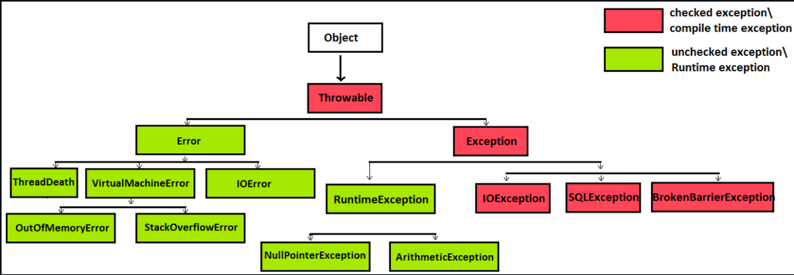

## 예외처리

### 예외와 에러


<br>
에러 : 프로그램 코드로 수습 불가능한 심각한 오류<br>
예외 : 프로그램 코드로 수습 가능한 다소 미약한 오류.

<br>

우리가 에러를 막을 순 없지만 예외 발생시에는 예외처리를 통해서 비정상적인 프로그램 종료를 막을 수 있다.


<br><br>

### Checked Exception과 Unchecked Exception
예외는 `Exception`클래스를 상속받은 클래스들을 말하며, 크게 두 종류로 나눌 수 있다.
* Unchecked Exception
  * `RuntimeException`클래스를 상속받은 클래스들
  * 비검사 예외
  * 예외처리를 하지 않아도 컴파일 에러가 발생하지 않음


* Checked Exception
  * Unchecked Exception을 제외한 나머지 클래스들 
  * 검사 예외
  * 예외처리 하지 않을시 컴파일 에러 발생
    * ex) IOException
    ```java
      BufferedReader br = new BufferedReader(new InputStreamReader(System.in));
      br.readLine(); //컴파일 에러 발생
    ```
  
  
<br><br>

### 예외처리 방법
1. `try catch`로 예외가 발생한 곳에서 직접 처리

```
...
try {
  BufferedReader br = new BufferedReader(new InputStreamReader(System.in));
  br.readLine();
} catch (IOException e) {
  //예외처리..
} 
```

2. 예외 던지기(예외 전가)

* 메서드 선언부에 메서드 시그니처(`throws {CheckedException명}`)를 추가.
* 메서드 호출부에서 예외를 처리하도록 책임을 전가한다.
```
public void read() throws IOException {
  BufferedReader br = new BufferedReader(new InputStreamReader(System.in));~~
  br.readLine();
}
```

3. 예외 되던지기
* 예외를 인위적으로 발생시키는 것.
  * `throw new {예외클래스명}`  != `throws`
* 메서드 호출부와 실행부 양쪽에 예외를 처리하도록 분담.
```java
public void validateNumber() throws IllegalArgumentException{
    try {
        value = Integer.parseInt(sc.nextLine());
    } catch (NumberFormatException e) {
        throw new IllegalArgumentExcpetion("숫자만 입력해주세요.");
    }
}
```

<br><br>

### 항상 가장 구체적인 예외 잡기
예외를 잡으려면 항상 가장 구체적인 예외 타입을 잡아야 한다. 일반적인 타입을 잡으면 잡아선 안 될 오류까지 집힐 위험이 있다.

```java
while (true) {
    try {
        value = Integer.parseInt(sc.nextLine());
        break;
    } catch (NumberFormatException e) { // O
        throw new IllegalArgumentException("숫자만 입력해주세요.");
    } catch (Exception e) { // X
        throw new IllegalArgumentException("숫자만 입력해주세요.");
    } 
}
System.out.println("value: " + value);
```

<br><br>

### 빈 catch 블록 설명하기

```java
class Logbook {

    static final Path LOG_FOLDER = Paths.get("/var/log");
    static final String FILE_FILTER = "*.log";

    List<Path> getLogs() throws IOException {
        List<Path> result = new ArrayList<>();
        try (DirectoryStream<Path> directoryStream = Files.newDirectoryStream(LOG_FOLDER,
            FILE_FILTER)) {
            for (Path logFile : directoryStream) {
                result.add(logFile);
            }
        } catch (NotDirectoryException e) {
        }
        return result;
    }
}

```
<br>

예외는 예외를 의미있게 처리할 수 있을 때에만 잡아야 한다. 하지만 아무 처리 없이 예외를 그냥 넘길 때도 있다.<br>
그런데 위 코드처럼 적혀있으면 이게 의도적으로 예외를 넘어가고 싶은 건지, 코드를 작성하다 만 건지, 실수한 건지 알 수 없다. 이를 
명확히 하기 위해 아래와 같이 코드를 작성하자.

```java
try (DirectoryStream<Path> directoryStream = Files.newDirectoryStream(LOG_FOLDER,
            FILE_FILTER)) {
            for (Path logFile : directoryStream) {
                result.add(logFile);
            }
        } catch (NotDirectoryException ignored) {
            // 디렉터리가 없으면 로그를 남기지 않습니다.
        }
        return result;

```
* 예외 변수명을 e에서 ignored로 바꾸어 예외를 무시하겠다는 것을 명시적으로 드러내 준다. 개발자들끼리의 약속, 규칙 같은 것.
* 예외를 무시한 의도를 주석으로 추가한다.

<br>


### 항상 자원 닫기
```java
static final Path LOG_FOLDER = Paths.get("/var/log");
static final String FILE_FILTER = "*.log";

List<Path> getLogs() throws IOException {
    List<Path> result = new ArrayList<>();
    DirectoryStream<Path> directoryStream = Files.newDirectoryStream(LOG_FOLDER, FILE_FILTER);
    for (Path logFile : directoryStream) {
        result.add(logFile);
    }
    directoryStream.close();

    return result;
}
```
* 프로그램이 자원을 연 후 close()로 자원을 해제하기 전에 자원 사용시 예외가 발생하면 close()를 실행하지 못할 수 있음.
  * 프로그램이 종료될 때까지 자원이 해제되지 못해 '자원 누출'이 발생.
* 자바 7부터 `try-with-resources` 으로 자원 해제 가능.
  * syntactic sugar

```java
...
        
try (DirectoryStream<Path> directoryStream =
        Files.newDirectoryStream(LOG_FOLDER, FILE_FILTER)) {
    for (Path logFile : directoryStream) {
        result.add(logFile);
    }
}

...
```
<br>

**자바7 시절**
```java
DirectoryStream<Path> directoryStream =
        Files.newDirectoryStream(LOG_FOLDER, FILE_FILTER);

try {
    //자원 사용    
} finally {
    if (resource != null) { // NullPointerException도 피할 수 있음.
        resource.close();    
    }
}
```


