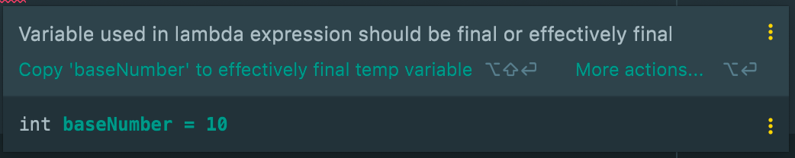
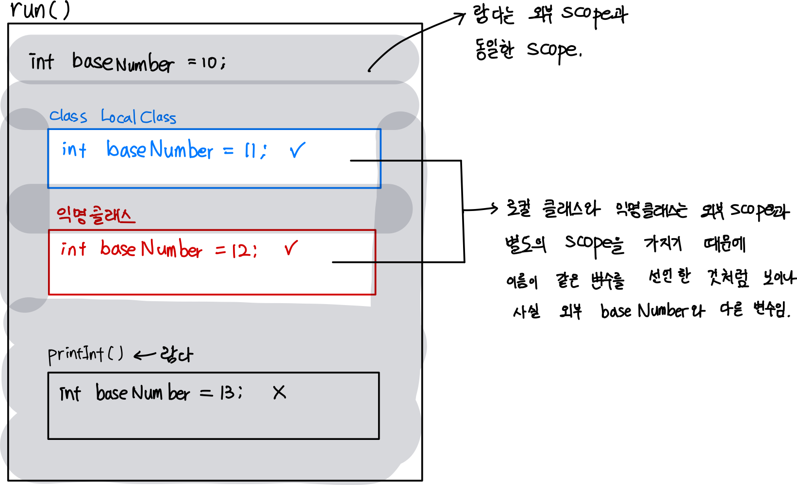

# 함수형 인터페이스와 람다 표현식

함수형 인터페이스란 오직 하나의 추상 메서드를 가지고 있는 인터페이스이다.
<br>

함수형 인터페이스의 구현체를 만드는 방식이 초기에는 클래스 인스턴스에서 익명 클래스로, 익명 클래스에서 람다식으로 바뀌며 코드 블럭을 다루는 방식이 점점 자유로워졌다.
<br>


```jsx
package java8to11;

@FunctionalInterface
public interface RunSomething {

    // static, default메서드가 있어도 추상메서드가 하나만 존재한다는 조건을 충족하면
    // 함수형 인터페이스이다.
    void oneAbstractMethod(); 

    static void printAbc() {
        System.out.println("abc");
    }

    default void printAbcd() {
        System.out.println("abcd");
    }
}
```

```jsx
public class Foo {

    public static void main(String[] args) {
        // 함수형 인터페이스 구현 방법 
        // 1. 익명 클래스 
        RunSomething runSomething = new RunSomething() {
            @Override
            public void oneAbstractMethod() {

            }
        };

        // 2. 람다 표현식 -> 실질적으로는 특수한 형태의 오브젝트. 함수를 선언한 것이 아니다. 
        RunSomething runSomething1 = () -> System.out.println("hello world");
    }

}
```

자바의 람다를 넓게 보면 FP의 일급객체와 같다. 메서드로 람다식을 리턴할 수 있고, 람다식을 메서드의 인자로 사용할 수 있기 때문.

# 자바 제공 기본 함수형 인터페이스

```java
RunSomething runSomething1 = () -> System.out.println("hello world");

Function<Integer, Integer> plus10 = (i) -> i + 10;
Function<Integer, Integer> multiply2 = (i) -> i * 2;

Function<Integer, Integer> multiply2AndPlus10 = plus10.compose(multiply2);
Function<Integer, Integer> plus10AndMultiply2 = multiply2.compose(plus10);
Function<Integer, Integer> mixedCrazy = multiply2AndPlus10.compose(plus10);

System.out.println(multiply2AndPlus10.apply(10)); // (10 x 2) + 10 == 30
System.out.println(plus10AndMultiply2.apply(10)); // (10 + 10) x 2 == 40
System.out.println(mixedCrazy.apply(10)); // ((10 + i) x 2) + (i + 10) -> 50
System.out.println(mixedCrazy.apply(5)); // ((10 + i) x 2) + (i + 10) -> 40

System.out.println(plus10.andThen(multiply2).apply(10)); //앞에 꺼 먼저 계산하고, 결과값이 뒤에 인풋으로 들어감.

UnaryOperator<Integer> unaryOperator = (i) -> i + 10;
System.out.println(unaryOperator.apply(10)); //20 -> Function 함수형 인터페이스의 특수 케이스. 인풋, 아웃풋의 자료형이 같은 경우
```

# 람다식 사용

## 캡처링

파라미터로 넘겨받은 변수가 아닌 외부에서 정의된 변수를 **자유변수**라 한다.
그리고 람다 바디 블록에서 자유 변수를 참조하는 행위를 **람다 캡처링** 이라고 한다.

## effective final

`람다`와 `익명클래스`, `로컬 클래스`에서 참조하는 자유변수는 `final` 변수일 때만 참조가 가능하다.

하지만 실제로 코드를 작성해보면 `final`을 붙이지 않아도 컴파일 에러가 나지 않는 걸 볼 수 있는데, 이는 그 변수가 사실상 final의 역할을 하기 때문이다. 그리고 그러한 경우에 해당 변수를 `effectiv final`이라 부른다.

사실상 final의 역할을 한다는 것은 그 변수가 이전에도, 앞으로도 값이 변경되지 않는 변수라는 뜻이다.

```java
private void run() {
    int baseNumber = 10;
    baseNumber++; //람다식이 참조하려는 자유변수의 값이 변경되는 경우
    
    //로컬클래스
    class LocalClass {
        void printBaseNumber() {
            System.out.println(baseNumber);//동일한 에러 발생
        }
    }

    //익명클래스
    Consumer<Integer> integerConsumer = new Consumer<Integer>() {
        @Override
        public void accept(Integer integer) {
            System.out.println(baseNumber);//동일한 에러 발생
        }
    };

    //람다
    IntConsumer pritnInt = (i) -> { 
        System.out.println(baseNumber + i); //동일한 에러 발생
    };
}
```

```java
private void run() {
    int baseNumber = 10;
		 
		...   

    IntConsumer pritnInt = (i) -> { 
        System.out.println(baseNumber + i);
    };
    printInt.accept(10);

    // 자유변수의 값이 변경되는 코드가 람다식의 선언, 실행부 이후에위치하더라도 
    // 마찬가지로 똑같은 에러가 발생한다.
    baseNumber++; 
}
```


<br><br>

## 셰도잉

익명클래스와 로컬 클래스에 선언된 변수는 외부 scope에 선언된 변수를 가릴 수 있다.

가린다는 말은 같은 메모리 영역에 값을 덮어 씌운다는 의미가 아니라, 익명클래스와 로컬 클래스에 선언된 변수가 외부 변수와 변수명이 같더라도 그 둘은 아예 다른 변수로서 존재하기 때문에 더 가까운 scope인 자기 자신의 변수에만 접근할 수 있다는 얘기이다.
<br><br>





## 참고
- 람다 컴파일, 런타임 단계에 일어나는 일 [https://dreamchaser3.tistory.com/5](https://dreamchaser3.tistory.com/5)
- [https://perfectacle.github.io/2019/06/30/java-8-lambda-capturing/](https://perfectacle.github.io/2019/06/30/java-8-lambda-capturing/)
