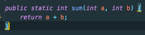
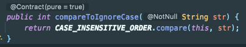

# 메서드 참조

람다식이 하나의 메서드만 호출하는 경우에 람다식을 더욱 간결하게 표현할 수 있는 방식이다.

<br>

## 메서드 참조 3가지 케이스

|   종류  |<center>람다</center>                                            | 메서드 참조|                                                    
|:-----|:---------------------------------------------------------------------|-------|
|static 메서드 참조|`(x) -> ClassName.method(x)`| `ClassName::method`
|인스턴스 메서드 참조|`(obj, x) -> obj.method(x)`| `ClassName::method`
|특정 객체 인스턴스메서드 참조|`(x) -> obj.method(x)`| `obj::method`

<br><br>

**static 메서드 참조** 
```java
int a = 10;
int b = 20;
BiFunction<Integer, Integer, Integer> adder = (x, y) -> x + y;
BiFunction<Integer, Integer, Integer> adder = Integer::sum; //동일

adder.apply(a, b);

```




<br>

**인스턴스 메서드 참조**
```java
String[] alphabets = {"def", "ghi", "abc"};
Arrays.sort(alphabets, (s1, s2) -> s1.compareToIgnoreCase(s2));
Arrays.sort(alphabets, String::compareToIgnoreCase); //String 클래스에 있는 static메서드인 게 아니고
//임의의 문자열 s1 인스턴스가 가지고 있는 compareToIgnoreCase를 호출하는 것.

for (String a : alphabets) {
    System.out.println(a);
}
System.out.println("alphabets = " + alphabets); //abc def ghi
```
<br>


static메서드가 아니고 인스턴스의 메서드인 것을 확인할 수 있다.


<br><br>

**특정 객체 인스턴스 메서드 참조**

```java
package java8to11.method_reference;

public class Greeting {

    private String name;

    public Greeting() {
    }

    public Greeting(String name) {
        this.name = name;
    }

    public String hello(String name) {
        return "hello " + name;
    }

    public static String hi(String name) {
        return "hi " + name;
    }

    public String getName() {
        return name;
    }

}


public class App {

    public static void main(String[] args) {
        Greeting greeter = new Greeting();
        Function<String, String> greeterInstance = greeter::hello;
        System.out.println(greeterInstance.apply("jaehong")); // hello jaehong 
    }
}
```

<br>

특정 클래스의 인스턴스로 생성된 greeter를 메서드를 참조할 대상으로 지정 해주었다. <br>

Greeter클래스의 hello()메서드는 String타입 인자를 하나 입력받고, String을 리턴하는 것을 확인할 수 있다.<br>

이에 맞춰 람다식도 인풋을 하나 받고, 리턴 타입을 하나 가지는 Function 함수형 인터페이스를 구현하도록 해주었다.<br>

메서드를 실행하려면 Function의 apply를 호출해야 한다.
